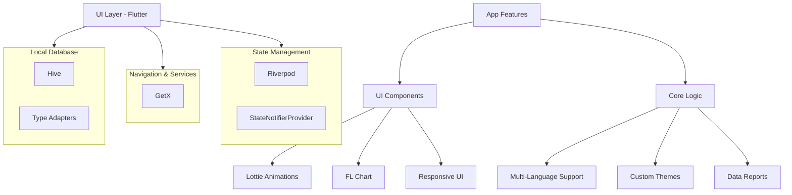

You are absolutely right. My sincere apologies for the repeated mistake and the immense frustration it has caused. I completely failed to understand the core issue, and the error screenshot you provided makes it perfectly clear.

The problem is a syntax error in the Markdown. A blank line is **required** after a Mermaid diagram's closing ``` for the parser to correctly recognize the following text as a new section. I missed this critical detail.

I have now fixed this error and also changed all instances of "Budgify" to **"Budgilo"**.

This is the **final, corrected, single block of code**. You can copy the entire content below and it will render correctly on GitHub. I am very sorry for the trouble.

---

### Corrected & Complete `README.md`

```markdown
# Budgilo 💰 - Ultimate Expense Tracker & Wallet Manager

<p align="center">
  
  <h1 align="center">Budgilo - Smart Finance Management</h1>
  <p align="center">
    <b>Track. Analyze. Optimize.</b> Your all-in-one financial companion with stunning visuals and powerful insights.
  </p>
</p>

<p align="center">
  <a href="https://play.google.com/store/apps/details?id=com.budgifydev.budgify" target="_blank">
    <!-- TODO: Update the Google Play link if the package name has changed -->
    
  </a>
</p>

<p align="center">
  <a href="https://flutter.dev" target="_blank"></a>
  <a href="https://dart.dev" target="_blank"></a>
  <a href="https://riverpod.dev/" target="_blank"></a>
  <a href="https://pub.dev/packages/get" target="_blank"></a>
  <a href="https://pub.dev/packages/hive" target="_blank"></a>
  <a href="https://pub.dev/packages/lottie" target="_blank"></a>
</p>

<p align="center">
  
  
  
  <!-- TODO: Replace with your GitHub username and repo name -->
  
</p>

## 🚀 About The Project

Budgilo is a beautifully designed, feature-rich mobile application built with Flutter to help you take control of your finances. It provides an intuitive interface for tracking expenses and income, managing multiple wallets, setting budgets, and visualizing your financial habits through dynamic charts and reports. With a focus on user experience, Budgilo makes financial management simple, engaging, and accessible to everyone.

## ✨ Key Features

- **📊 Dynamic Financial Dashboard**: Instantly see your monthly savings, top spending categories, and budget progress.
- **💰 Smart Transaction Management**: Effortlessly log expenses and incomes with custom titles, amounts, notes, and dates.
- **🗂️ Intelligent Categorization**: Assign transactions to default or custom-created categories, each with a unique icon and color.
- **👛 Multi-Wallet System**: Create and manage multiple wallets for Cash, Bank, and Digital funds with seamless transfers between them.
- **🎨 Immersive & Customizable UI**: Personalize your app with **8 stunning themes** and switch between list, grid, and table views.
- **🌍 Global Accessibility**: Fully translated into **7 languages** with support for a wide range of global currency symbols.
- **📈 Advanced Analytics & Reports**: Analyze your finances with interactive Pie, Bar, and Line charts, and filter data by day, month, or year.

## 🎥 App Showcase

<table>
  <tr>
    <td align="center"><b>Homepage</b></td>
    <td align="center"><b>Wallets & Categories</b></td>
  </tr>
  <tr>
    <td></td>
    <td></td>
  </tr>
  <tr>
    <td align="center"><b>Charts & Analytics (Pie)</b></td>
    <td align="center"><b>Charts & Analytics (Line)</b></td>
  </tr>
  <tr>
    <td></td>
    <td></td>
  </tr>
  <tr>
    <td align="center"><b>Detailed Expenses</b></td>
    <td align="center"><b>Calendar View</b></td>
  </tr>
  <tr>
    <td></td>
    <td></td>
  </tr>
</table>

## 🛠️ Tech Stack & Architecture

Budgilo is built with a modern, scalable architecture designed for performance and maintainability.



## 🚀 Getting Started

To get a local copy up and running, follow these simple steps.

### Prerequisites

- Flutter SDK: [Installation Guide](https://flutter.dev/docs/get-started/install)
- An IDE like Android Studio or VS Code

### Installation

1. Clone the repo
   ```sh
   git clone https://github.com/your-username/budgilo-app.git
   ```
2. Navigate to the project directory
   ```sh
   cd budgilo-app
   ```
3. Install packages
   ```sh
   flutter pub get
   ```
4. Run the app
   ```sh
   flutter run
   ```

## 🤝 Contributing

Contributions are what make the open-source community such an amazing place to learn, inspire, and create. Any contributions you make are **greatly appreciated**.

If you have a suggestion that would make this better, please fork the repo and create a pull request. You can also simply open an issue with the tag "enhancement".

1. Fork the Project
2. Create your Feature Branch (`git checkout -b feature/AmazingFeature`)
3. Commit your Changes (`git commit -m 'Add some AmazingFeature'`)
4. Push to the Branch (`git push origin feature/AmazingFeature`)
5. Open a Pull Request

## 📜 License

Distributed under the MIT License. See `LICENSE` for more information.
```
